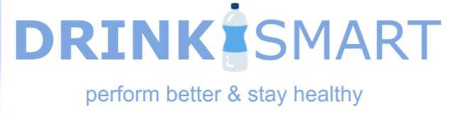
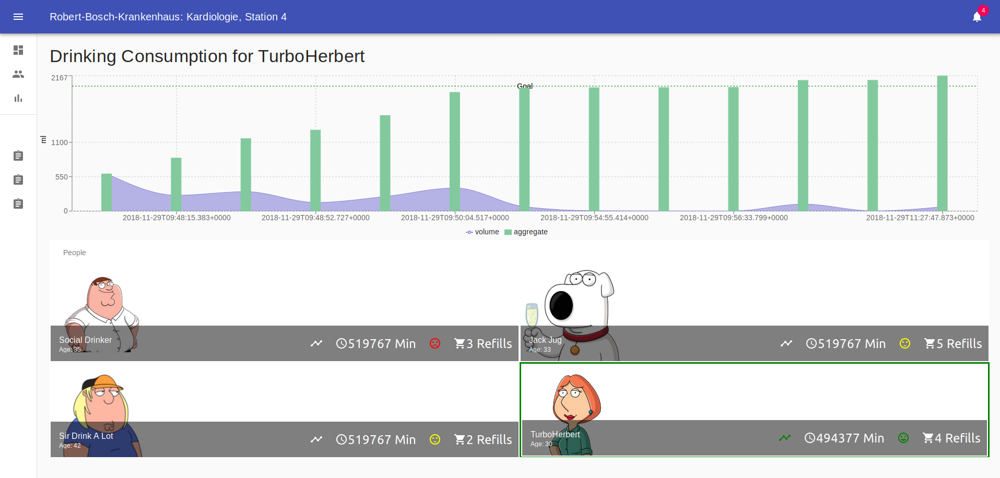

<p align="center">
  
</p>

# The Dashboard

This dashboard shows all the connected DrinkSmart bottles und displays their corresponding consumption.

<p align="center">
  
</p>

## Getting Started

```
git clone https://github.com/drink-smart/dashboard.git
npm install
npm run start
```

